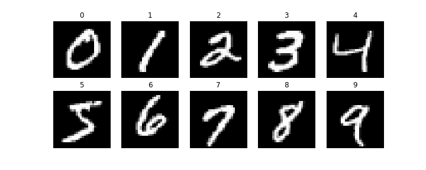

# Perceptrón Multicapa con Keras y PyTorch
Introducción a los algoritmos de aprendizaje profundo y aplicaciones:

* Como primera arquitectura se tiene una red neuronal perceptrón multicapa.
* Se utilizara la base de datos MNIST para reconocer digitos escritos a mano.
* Comparación de implementación Keras vs PyToch.

## MNIST
Ejemplo de imagenes contenidas en la base de datos MNIST:



## Arquitectura de la Red con Keras
```
nn = models.Sequential()    
nn.add(layers.Dense(units=512,activation='relu', input_shape=(szIm,)))         
nn.add(layers.Dense(units=10, activation='softmax'))
```

## Arquitectura de la Red con PyTorch
```
class MLP(nn.Module):
    def __init__(self):
        super(MLP, self).__init__()
        self.fc1 = nn.Linear(28*28, 512) # capa oculta 
        self.fc2 = nn.Linear(512, 10) # capa de salida 
        
        self.loss_criterion = nn.CrossEntropyLoss() # Función de pérdida

    def forward(self, x, target):
        # transforma las imágenes de tamaño (n, 28, 28) a (n, 784)
        x = x.view(-1, 28*28) 
        
        # Capa oculta y su funcion de activacion
        x = F.relu(self.fc1(x)) # Función de activación relu en la salida de la capa oculta
        
        # Capa de salida y su funcion de activacion
        x = F.softmax(self.fc2(x), dim=1) # Función de activación softmax en la salida de la capa de salida
        
        loss = self.loss_criterion(x, target) # Calculo de la función de pérdida 
        return x, loss
```

## Resultados
Para 10 epocas y batch size de 128 obtenemos:

| | Tensorflow-Keras | Pytorch |
| --- | ---         |     ---      |
| acc train | 0.9972 | 0.9872 |
| acc test | 0.9816 | 0.9783 |
| loss train | 0.0103 | 0.011531 |
| loss test | 0.071285 | 0.011723 |
| time | 23.3069 | 149.64856 |


